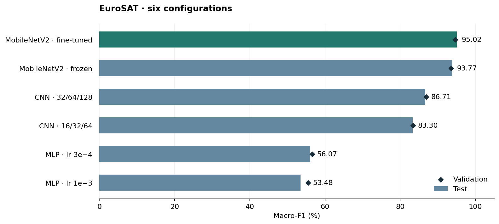

# EuroSAT in PyTorch

Six experiments on land-cover classification, extending an exercise from a deep
learning course I teach. The new PyTorch implementation fits in [one notebook](eurosat.ipynb),
from data inspection to training and error analysis.

## Results

Measured on a **Colab Tesla T4**, using 16,200 training, 5,400 validation and
5,400 test images. Each checkpoint and the final model were selected by
**validation macro-F1**, before evaluating the six predefined configurations on test.

| Configuration | Test accuracy | Test macro-F1 | Trainable parameters | T4 time |
|---|---:|---:|---:|---:|
| MLP · lr 1e-3 | 54.33% | 0.5348 | 3,148,554 | 2m 48s |
| MLP · lr 3e-4 | 56.98% | 0.5607 | 3,148,554 | 2m 44s |
| CNN · 16/32/64 channels | 83.94% | 0.8330 | 24,346 | 2m 48s |
| CNN · 32/64/128 channels | 87.22% | 0.8671 | 94,762 | 2m 49s |
| MobileNetV2 · frozen backbone | 94.00% | 0.9377 | 12,810 | 3m 24s |
| **MobileNetV2 · partial fine-tuning** | **95.22%** | **0.9502** | **1,207,690** | **5m 31s** |

Times include training and validation. Fine-tuning includes the frozen stage;
the extra stage took 2m 07s. Total across all six stages: **16m 39s**.
Downloads, final test evaluation and ImageNet pretraining are excluded.

Three observations from this run:

- Lowering the MLP learning rate helps, but its 3.15 million parameters still
  perform well below the small CNN's 24,346.
- Doubling CNN width adds **3.41 points of test macro-F1**. The best validation
  checkpoint is epoch 8, although training loss keeps falling through epoch 12.
- The pretrained features work well with a new classifier alone. Partial fine-tuning
  adds **1.25 points of test macro-F1**: 99 errors corrected, 33 new ones.

Of 258 mistakes, the main confusions are River/Highway and
PermanentCrop/HerbaceousVegetation ([matrix](figures/confusion_matrix.png)).
68 mistakes have a softmax score ≥ 0.90; confidence is uncalibrated.

## Experiment

- **MLP:** one 256-unit hidden layer; learning rates `1e-3` and `3e-4`, 12 epochs each.
- **CNN:** three convolution blocks; two widths, `1e-3`, 12 epochs each.
- **MobileNetV2:** ImageNet weights; classifier only for 8 epochs at `1e-3`, then
  the last three feature blocks for 5 more at `1e-5`. BatchNorm stays frozen.

All use AdamW, cross-entropy, batch size 128 and seed 42. No augmentation.
The stratified 60/20/20 split is shared. Decoded RGB hashes found no exact duplicates.
Within each MLP/CNN pair, only the stated hyperparameter changes.

One seed and a random image split do not establish generalization to new regions.
The transfer comparison changes architecture, pretraining, resolution (64 → 128)
and training budget together; it does not isolate their individual effects.

## Run

1. Upload `eurosat.ipynb` to [Colab](https://colab.research.google.com/).
2. Select **Runtime → Change runtime type → T4 GPU**. Keep its installed packages.
3. Choose a new `RUN_NAME`, run the cells in order and connect Drive when prompted.
4. Download the results ZIP. Checkpoints stay in `MyDrive/eurosat-pytorch/<RUN_NAME>`.

Completed experiments can be reused; an interrupted
experiment restarts from epoch 1. Local use: install `requirements.txt` with the
appropriate PyTorch build and set `SAVE_TO_DRIVE=False`.

`results/` holds the recorded metrics, histories, predictions, split and exact
settings. Dataset archives and checkpoints stay outside the repo.

## Sources

[EuroSAT — Helber et al.](https://github.com/phelber/EuroSAT) ·
[Torchvision dataset download](https://docs.pytorch.org/vision/stable/_modules/torchvision/datasets/eurosat.html) ·
[MobileNetV2 weights](https://docs.pytorch.org/vision/stable/models/generated/torchvision.models.mobilenet_v2.html)

Sample images in the notebook are from EuroSAT. See the authors' repository for
data terms and attribution.
